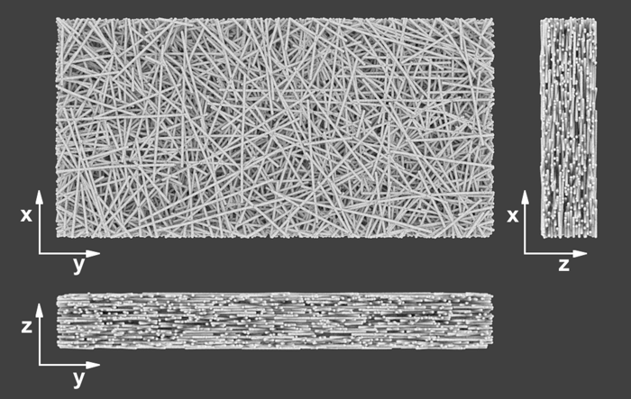

### General information

The repository contains code for a stochastic fiber network generator. The code was written in the MATALB scripting language.

Fibres are generated based using the multisphere approach. Each fiber consists of a sequence of spheres arranged one after another, at a fixed distance from each other.The fibres are generated one by one, each fibre in sequential process. Individual fibres are generated randomly in three dimensional space to create layers of fibres filling cuboidal space, mimicking stripes cut out from bacterial cellulose  pellicles. Fibres protruding outside the model area are removed or shortened.

#### build_model.m
Main script demostrating usage of fibre generator. First, script generates fibre network based on the predefined input parameters. Next, an simulation model file is written based on coordiantes of generated fibres. The model is built to reflect uniaxial tensile test conditions. The model is saved to a text file, in the format used by the FibreNet molecular dynamics simulation software (https://github.com/ppieczywek/FibreNet).

#### generate_fibre_network.m
File contains the stochastic generator code. Provided function  generates the coordinates of individual fiber segments in 3D space. The modelled fibers consist of a finite number of segments of equal length. The function allows to control fiber radius, length, position, alignment direction, curvature and packing density of the fibers in 3D space.

#### save_model_to_xyz.m
Writes the output structure of fiber network generators to a general XYZ format. This allows visualization of the model in programs like Blender with the AtomicBlender add-on.
